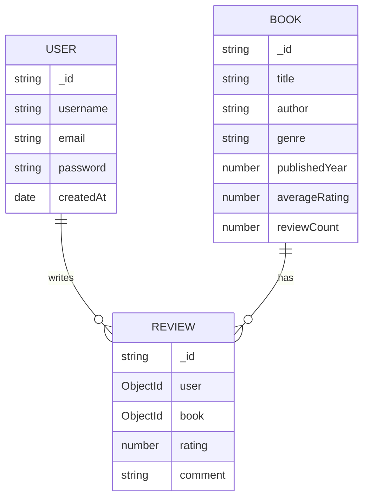

# 📚 Book Review API

A RESTful API for managing books and reviews built with Node.js, Express, and MongoDB.

## 🌟 Features
- JWT Authentication (Signup/Login)
- Book Management (CRUD Operations)
- Review System with Rating Calculations
- Paginated Responses
- Case-insensitive Search
- Input Validation
- Protected Routes

## 🛠 Tech Stack
- **Backend**: Node.js, Express
- **Database**: MongoDB
- **Authentication**: JWT
- **Testing**: Postman (see examples below)

## 🚀 Getting Started

### Prerequisites
- Node.js v18+
- MongoDB v4.4+
- npm v8+

### Installation
```bash
git clone https://github.com/kartikgarg3000/book-review-api.git
cd book-review-api
npm install

Configuration
Create .env file:

env
PORT=5000
MONGO_URI=mongodb://localhost:27017/book_review
JWT_SECRET=your_secure_jwt_secret_here
JWT_EXPIRE=30d

Running the Server
bash
# Start MongoDB service (Windows)
net start MongoDB

# Start the application
npm start
Server runs at http://localhost:5000

📡 API Reference

Authentication
Endpoint	Method	Description	Auth Required
/api/auth/signup	POST	Register new user	No
/api/auth/login	POST	User login	No

Books
Endpoint	Method	Description	Auth Required
/api/books	POST	Add new book	Yes
/api/books	GET	Get all books (paginated)	No
/api/books/:id	GET	Get book details	No
/api/books/search	GET	Search books	No

Reviews
Endpoint	Method	Description	Auth Required
/api/books/:id/reviews	POST	Add review	Yes
/api/reviews/:id	PUT	Update review	Yes
/api/reviews/:id	DELETE	Delete review	Yes

📋 Database Schema

User
{
  username: { type: String, required: true, unique: true },
  email: { type: String, required: true, unique: true },
  password: { type: String, required: true },
  createdAt: { type: Date, default: Date.now }
}

Book
{
  title: { type: String, required: true },
  author: { type: String, required: true },
  genre: { type: String, required: true },
  description: { type: String, required: true },
  publishedYear: { type: Number },
  averageRating: { type: Number, default: 0 },
  reviewCount: { type: Number, default: 0 },
  createdAt: { type: Date, default: Date.now }
}

Review
{
  user: { type: ObjectId, ref: 'User', required: true },
  book: { type: ObjectId, ref: 'Book', required: true },
  rating: { type: Number, required: true, min: 1, max: 5 },
  comment: { type: String, required: true },
  createdAt: { type: Date, default: Date.now }
}

📊 Entity Relationship Diagram



🏗 Project Structure

book-review-api/
├── src/
│   ├── config/       # DB and environment config
│   ├── controllers/  # Business logic
│   ├── middleware/   # Auth & validation
│   ├── models/       # Mongoose schemas
│   ├── routes/       # API endpoints
│   └── app.js        # Express application
├── .env.example      # Environment variables template
├── package.json
└── README.md

🎯 Design Decisions

Authentication

JWT with 30-day expiry

Password hashing using bcrypt

Protected routes for sensitive operations

Performance

Pagination (default 10 items/page)

Indexed search fields

Lean queries for faster responses

Security

Environment variables for secrets

Input sanitization

Rate limiting (100 requests/15min)

Extensibility

Modular architecture

Clear separation of concerns

Easy-to-extend schemas
