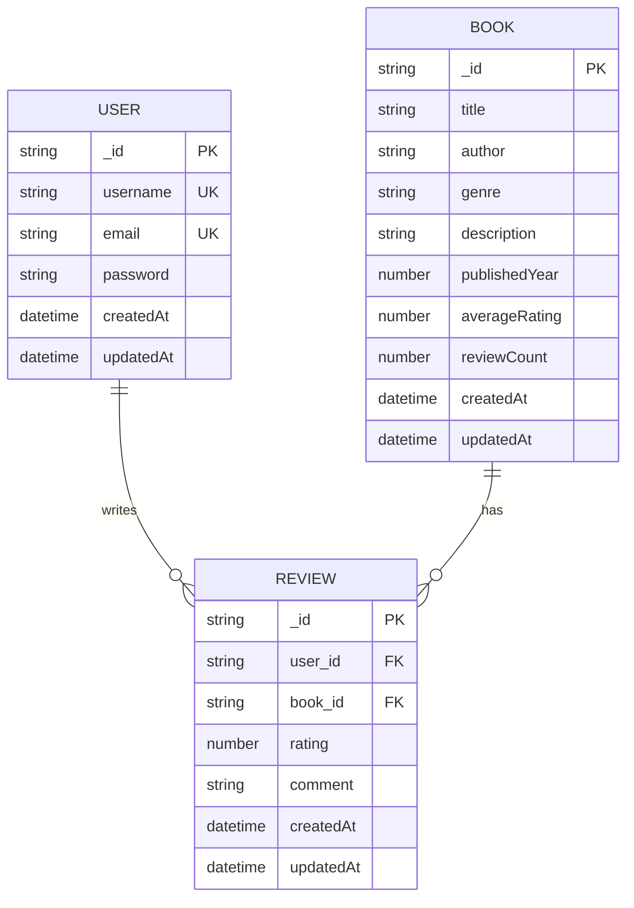

# 📚 Book Review API

A RESTful API for managing books and reviews built with Node.js, Express, and MongoDB.

## 🌟 Features
- JWT Authentication (Signup/Login)
- Book Management (CRUD Operations)
- Review System with Rating Calculations
- Paginated Responses
- Case-insensitive Search
- Input Validation
- Protected Routes

## 🛠 Tech Stack
- **Backend**: Node.js, Express
- **Database**: MongoDB
- **Authentication**: JWT
- **Testing**: Postman

## 🚀 Getting Started

### Prerequisites
- Node.js v18+
- MongoDB v4.4+
- npm v8+

### Installation
```bash
# Clone the repository
git clone https://github.com/yourusername/book-review-api.git
cd book-review-api

# Install dependencies
npm install
```

### Configuration
Create `.env` file in the root directory:
```env
PORT=5000
MONGO_URI=mongodb://localhost:27017/book_review
JWT_SECRET=your_secure_jwt_secret_here
JWT_EXPIRE=30d
```

### Running the Server
```bash
# Start MongoDB service (Windows)
net start MongoDB

# Start the application
npm start
```
Server runs at http://localhost:5000

## 📡 API Reference

### Authentication
| Endpoint | Method | Description | Auth Required |
|----------|--------|-------------|---------------|
| /api/auth/signup | POST | Register new user | No |
| /api/auth/login | POST | User login | No |

### Books
| Endpoint | Method | Description | Auth Required |
|----------|--------|-------------|---------------|
| /api/books | POST | Add new book | Yes |
| /api/books | GET | Get all books (paginated) | No |
| /api/books/:id | GET | Get book details | No |
| /api/books/search | GET | Search books | No |

### Reviews
| Endpoint | Method | Description | Auth Required |
|----------|--------|-------------|---------------|
| /api/books/:id/reviews | POST | Add review | Yes |
| /api/reviews/:id | PUT | Update review | Yes |
| /api/reviews/:id | DELETE | Delete review | Yes |

## 📋 Database Schema

### User
```javascript
{
    username: { type: String, required: true, unique: true },
    email: { type: String, required: true, unique: true },
    password: { type: String, required: true },
    createdAt: { type: Date, default: Date.now }
}
```

### Book
```javascript
{
    title: { type: String, required: true },
    author: { type: String, required: true },
    genre: { type: String, required: true },
    description: { type: String, required: true },
    publishedYear: { type: Number },
    averageRating: { type: Number, default: 0 },
    reviewCount: { type: Number, default: 0 },
    createdAt: { type: Date, default: Date.now }
}
```

### Review
```javascript
{
    user: { type: ObjectId, ref: 'User', required: true },
    book: { type: ObjectId, ref: 'Book', required: true },
    rating: { type: Number, required: true, min: 1, max: 5 },
    comment: { type: String, required: true },
    createdAt: { type: Date, default: Date.now }
}
```

## 📊 Entity Relationship Diagram



### Relationships
- One User can write many Reviews (1:N)
- One Book can have many Reviews (1:N)
- Each Review must belong to exactly one User and one Book

### Legend
- PK: Primary Key
- FK: Foreign Key
- UK: Unique Key

## 🏗 Project Structure
```
book-review-api/
├── src/
│   ├── config/       # DB and environment config
│   ├── controllers/  # Business logic
│   ├── middleware/   # Auth & validation
│   ├── models/       # Mongoose schemas
│   ├── routes/       # API endpoints
│   └── app.js        # Express application
├── .env.example      # Environment variables template
├── package.json
└── README.md
```

## 🎯 Design Decisions

### Authentication
- JWT with 30-day expiry
- Password hashing using bcrypt
- Protected routes for sensitive operations

### Performance
- Pagination (default 10 items/page)
- Indexed search fields
- Lean queries for faster responses

### Security
- Environment variables for secrets
- Input sanitization
- Rate limiting (100 requests/15min)

### Extensibility
- Modular architecture
- Clear separation of concerns
- Easy-to-extend schemas

## 📝 API Usage Examples

### Register a new user
```bash
curl -X POST http://localhost:5000/api/auth/signup \
-H "Content-Type: application/json" \
-d '{
    "username": "testuser",
    "email": "test@example.com",
    "password": "password123"
}'
```

### Add a new book (with auth token)
```bash
curl -X POST http://localhost:5000/api/books \
-H "Content-Type: application/json" \
-H "Authorization: Bearer YOUR_TOKEN" \
-d '{
    "title": "The Great Book",
    "author": "John Doe",
    "genre": "Fiction",
    "description": "An amazing story"
}'
```